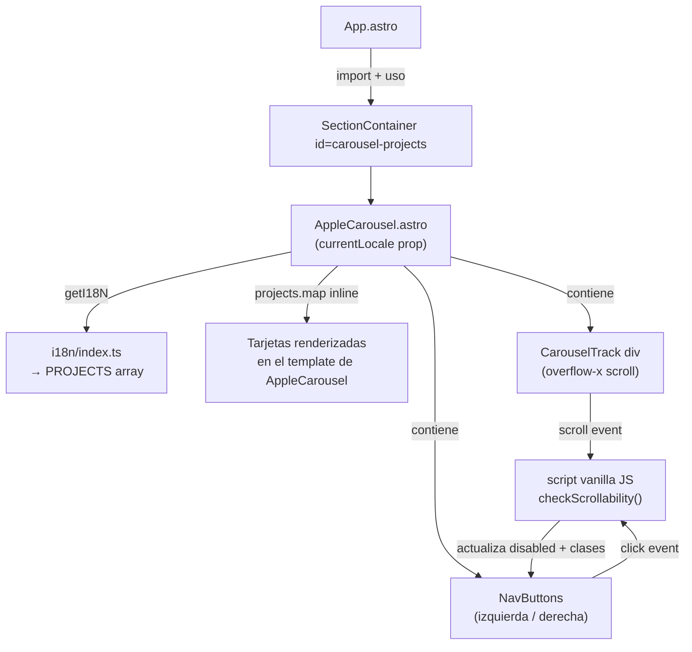

# Design Document — apple-carousel

## Overview

Este feature agrega un carrusel horizontal estilo Apple al portafolio personal construido con Astro y Tailwind CSS. El carrusel se inserta como una sección independiente **después** de la sección `#projects` existente (`Test.astro`), sin modificarla. Muestra los 6 proyectos del portafolio como tarjetas navegables con scroll suave, botones de navegación izquierda/derecha que se deshabilitan automáticamente según la posición del scroll, y adaptación responsiva entre móvil y escritorio.

El componente es Astro puro (sin frameworks externos), soporta i18n (en/es/fr) mediante el sistema `getI18N` existente, y respeta el sistema de temas claro/oscuro con variantes `dark:` de Tailwind.

### Objetivos de diseño

- **Cero dependencias nuevas**: solo Astro, Tailwind CSS y vanilla JS en `<script>`.
- **No invasivo**: no toca `Test.astro`, `App.astro` (salvo agregar el import y la sección), ni los JSON de i18n existentes (salvo agregar las claves de accesibilidad del carrusel).
- **Accesible**: botones con `aria-label` i18n, track con `role="region"`, estados `aria-disabled` sincronizados.
- **Responsivo**: tarjetas de 230×320px en móvil, 384×480px en escritorio.
- **Optimizado para Astro**: un único componente `AppleCarousel.astro` (sin `CarouselCard.astro` separado), `<script>` con scope automático via `data-*` attributes, y **100% Tailwind CSS** en el template — sin bloques `<style>` ni CSS vanilla. Solo se necesita un `<style>` mínimo para las dos reglas que Tailwind no puede expresar: `scrollbar-width: none` y `::-webkit-scrollbar { display: none }`.

---

## Architecture

El carrusel sigue la arquitectura de componentes existente del proyecto: componentes `.astro` estáticos con lógica de interactividad en bloques `<script>` vanilla JS.

### Decisión clave: un solo componente

A diferencia del diseño inicial que proponía `AppleCarousel.astro` + `CarouselCard.astro`, se usa **un único componente** `AppleCarousel.astro`. Las tarjetas se renderizan inline con `{projects.map(...)}` en el template. Esto es más idiomático en Astro porque:

- Las tarjetas no tienen estado propio ni lógica JS independiente.
- Evita el overhead de un componente extra para algo que es solo HTML + CSS.
- El `<script>` del componente tiene scope automático al componente gracias al sistema de Astro.



### Flujo de datos

1. `App.astro` pasa `currentLocale` a `AppleCarousel`.
2. `AppleCarousel` llama a `getI18N({ currentLocale })` para obtener `i18n.PROJECTS` (array de 6 proyectos) y `i18n.TITLES.projects` (título de sección).
3. Construye un array `projectsWithImages` combinando los datos i18n con las rutas de imagen estáticas.
4. Renderiza todas las tarjetas inline con `{projectsWithImages.map(...)}`.
5. El bloque `<script>` vanilla JS usa `document.querySelector` con el atributo `data-carousel` para encontrar el track y los botones, evitando colisiones de IDs si el componente se instancia más de una vez.

---

## Components and Interfaces

### `AppleCarousel.astro` (único componente)

**Ubicación**: `src/components/AppleCarousel.astro`

**Props**:
```typescript
interface Props {
  currentLocale?: string; // default: 'en'
}
```

**Responsabilidades**:
- Obtener `i18n.PROJECTS` y `i18n.TITLES.projects` via `getI18N`.
- Construir `projectsWithImages` combinando datos i18n + rutas de imagen.
- Renderizar el encabezado de sección.
- Renderizar el `CarouselTrack` con todas las tarjetas inline usando clases Tailwind.
- Renderizar los dos NavButtons con `aria-label` i18n.
- Incluir el bloque `<script>` con la lógica de scroll.
- Incluir un `<style>` mínimo solo para las dos reglas que Tailwind no puede expresar: `scrollbar-width: none` y `::-webkit-scrollbar { display: none }`.

**Estructura del frontmatter (Astro)**:
```astro
---
import { getI18N } from '@/i18n';

interface Props {
  currentLocale?: string;
}

const { currentLocale = 'en' } = Astro.props;
const i18n = getI18N({ currentLocale });

const PROJECT_IMAGES = [
  '/projects/bg.webp',
  '/projects/api2.webp',
  '/projects/spo.webp',
  '/projects/emma.webp',
  '/projects/vit.webp',
  '/projects/v12Magazinea.png',
];

const projectsWithImages = i18n.PROJECTS.map((p, i) => ({
  ...p,
  image: PROJECT_IMAGES[i] ?? '',
}));
---
```

**Estructura HTML del template**:
```astro
<div class="relative w-full" data-carousel-root>

  <!-- Track scrollable -->
  <div
    data-carousel-track
    role="region"
    aria-label={i18n.CAROUSEL.regionLabel}
    class="flex gap-4 overflow-x-auto scroll-smooth py-10 md:py-20 pl-4 carousel-hide-scrollbar"
  >
    {projectsWithImages.map((project, i) => (
      <div
        class="relative flex-shrink-0 w-[230px] h-[320px] md:w-96 md:h-[480px]
               rounded-2xl overflow-hidden cursor-pointer
               bg-cover bg-center
               transition-transform duration-300 ease-in-out hover:scale-[1.03]"
        data-carousel-card
        data-index={i}
        style={`background-image: url('${project.image}')`}
        role="img"
        aria-label={project.title}
      >
        {/* Gradient overlay */}
        <div class="absolute inset-0 bg-gradient-to-b from-transparent to-black/70" />

        {/* Text content */}
        <div class="absolute bottom-0 left-0 right-0 p-4 z-10">
          <h3 class="text-white font-semibold text-lg leading-tight">{project.title}</h3>
          {project.subtitle && (
            <p class="text-white/70 text-sm mt-1">{project.subtitle}</p>
          )}
        </div>
      </div>
    ))}
  </div>

  <!-- Navigation buttons -->
  <div class="flex justify-end gap-2 mt-3 pr-2">
    <button
      data-carousel-btn-left
      aria-label={i18n.CAROUSEL.scrollLeft}
      aria-disabled="true"
      disabled
      class="flex items-center justify-center size-10 rounded-full
             bg-gray-100 dark:bg-gray-800
             text-gray-500 dark:text-gray-400
             transition-opacity duration-200
             disabled:opacity-40 disabled:cursor-not-allowed"
    >
      <svg xmlns="http://www.w3.org/2000/svg" class="size-5" fill="none"
           viewBox="0 0 24 24" stroke="currentColor" stroke-width="2">
        <path stroke-linecap="round" stroke-linejoin="round" d="M15 19l-7-7 7-7" />
      </svg>
    </button>
    <button
      data-carousel-btn-right
      aria-label={i18n.CAROUSEL.scrollRight}
      class="flex items-center justify-center size-10 rounded-full
             bg-gray-100 dark:bg-gray-800
             text-gray-500 dark:text-gray-400
             transition-opacity duration-200
             disabled:opacity-40 disabled:cursor-not-allowed"
    >
      <svg xmlns="http://www.w3.org/2000/svg" class="size-5" fill="none"
           viewBox="0 0 24 24" stroke="currentColor" stroke-width="2">
        <path stroke-linecap="round" stroke-linejoin="round" d="M9 5l7 7-7 7" />
      </svg>
    </button>
  </div>

</div>

{/* Minimal style block — only for what Tailwind cannot express */}
<style>
  .carousel-hide-scrollbar { scrollbar-width: none; }
  .carousel-hide-scrollbar::-webkit-scrollbar { display: none; }
</style>
```

**Mapeo de clases Tailwind → propiedades CSS**:

| Elemento | Clases Tailwind | Equivalente CSS |
|---|---|---|
| Track | `flex gap-4 overflow-x-auto scroll-smooth py-10 md:py-20 pl-4` | flex layout, gap, scroll, padding |
| Track scrollbar | `carousel-hide-scrollbar` (style mínimo) | `scrollbar-width: none` + webkit |
| Tarjeta | `relative flex-shrink-0 w-[230px] h-[320px] md:w-96 md:h-[480px]` | dimensiones responsivas |
| Tarjeta | `rounded-2xl overflow-hidden cursor-pointer bg-cover bg-center` | forma, imagen de fondo |
| Tarjeta hover | `transition-transform duration-300 ease-in-out hover:scale-[1.03]` | efecto hover |
| Overlay | `absolute inset-0 bg-gradient-to-b from-transparent to-black/70` | degradado |
| Título | `text-white font-semibold text-lg leading-tight` | tipografía |
| Subtítulo | `text-white/70 text-sm mt-1` | tipografía secundaria |
| Nav wrapper | `flex justify-end gap-2 mt-3 pr-2` | layout botones |
| Botón | `flex items-center justify-center size-10 rounded-full` | forma y layout |
| Botón | `bg-gray-100 dark:bg-gray-800 text-gray-500 dark:text-gray-400` | colores con dark mode |
| Botón disabled | `disabled:opacity-40 disabled:cursor-not-allowed` | estado deshabilitado |

**Por qué solo 2 líneas de CSS vanilla**:
Tailwind no tiene utilidades para `scrollbar-width: none` (propiedad Firefox) ni para el pseudo-elemento `::-webkit-scrollbar`. Todo lo demás — incluyendo dimensiones arbitrarias con `w-[230px]`, gradientes, dark mode, hover y disabled states — se expresa directamente con clases Tailwind.

**Bloque `<script>` (vanilla JS)**:

```javascript
document.addEventListener('astro:page-load', () => {
  document.querySelectorAll('[data-carousel-root]').forEach((root) => {
    const track = root.querySelector('[data-carousel-track]');
    const btnLeft = root.querySelector('[data-carousel-btn-left]');
    const btnRight = root.querySelector('[data-carousel-btn-right]');
    if (!track || !btnLeft || !btnRight) return;

    function checkScrollability() {
      const { scrollLeft, scrollWidth, clientWidth } = track;
      const canLeft = scrollLeft > 0;
      const canRight = scrollLeft + clientWidth < scrollWidth - 1;
      setBtn(btnLeft, !canLeft);
      setBtn(btnRight, !canRight);
    }

    function setBtn(btn, isDisabled) {
      btn.disabled = isDisabled;
      btn.setAttribute('aria-disabled', String(isDisabled));
    }

    btnLeft.addEventListener('click', () => {
      track.scrollBy({ left: -300, behavior: 'smooth' });
    });
    btnRight.addEventListener('click', () => {
      track.scrollBy({ left: 300, behavior: 'smooth' });
    });

    track.addEventListener('scroll', checkScrollability, { passive: true });
    checkScrollability(); // estado inicial
  });
});
```

**Notas del script**:
- `astro:page-load` en lugar de `DOMContentLoaded` para compatibilidad con View Transitions de Astro.
- `{ passive: true }` en el listener de scroll para no bloquear el hilo principal.
- `querySelectorAll` + `forEach` para soportar múltiples instancias del componente.
- Los estados `disabled:opacity-40` y `disabled:cursor-not-allowed` los maneja Tailwind directamente via el atributo `disabled` del botón — el script solo necesita setear `btn.disabled` y `aria-disabled`, sin tocar clases CSS.

---

### Integración en `App.astro`

Se agrega un nuevo `SectionContainer` inmediatamente después del `#projects` existente:

```astro
import AppleCarousel from '@/components/AppleCarousel.astro';

<!-- después del SectionContainer id="projects" -->
<SectionContainer id="carousel-projects">
  <AppleCarousel currentLocale={currentLocale} />
</SectionContainer>
```

---

### Claves i18n nuevas (`CAROUSEL`)

Se agregan en los tres archivos JSON (`en.json`, `es.json`, `fr.json`):

```json
"CAROUSEL": {
  "scrollLeft":  "Scroll left",
  "scrollRight": "Scroll right",
  "regionLabel": "Projects carousel"
}
```

Traducciones:
- `es`: `"Desplazar a la izquierda"`, `"Desplazar a la derecha"`, `"Carrusel de proyectos"`
- `fr`: `"Défiler à gauche"`, `"Défiler à droite"`, `"Carrousel de projets"`

El tipo `I18nKeys` en `index.ts` se infiere automáticamente desde `en.json`, por lo que agregar la clave en `en.json` es suficiente para que TypeScript la reconozca; `es.json` y `fr.json` se fusionan via `deepMerge`.

---

## Data Models

### `ProjectImageMap`

Array estático en el frontmatter de `AppleCarousel.astro`:

```typescript
const PROJECT_IMAGES: string[] = [
  '/projects/bg.webp',          // 0 - NBD Landscaping
  '/projects/api2.webp',        // 1 - Cities API
  '/projects/spo.webp',         // 2 - Spotify Clone
  '/projects/emma.webp',        // 3 - Emma's Small Engines
  '/projects/vit.webp',         // 4 - VitGreen
  '/projects/v12Magazinea.png', // 5 - V12 Magazine
];
```

### `ProjectWithImage`

Tipo derivado en el frontmatter, combinando datos i18n + imagen:

```typescript
// Inferido automáticamente por TypeScript desde el map
const projectsWithImages = i18n.PROJECTS.map((p, i) => ({
  ...p,                          // title, subtitle, description, gallery, code, link
  image: PROJECT_IMAGES[i] ?? '',
}));
// Tipo: Array<{ title: string; subtitle: string; image: string; ... }>
```

### `ScrollState` (runtime, en JS)

Estado lógico recalculado en cada evento `scroll`:

```typescript
// Función pura extraída para testabilidad
// src/scripts/carouselScrollState.ts
export interface ScrollDimensions {
  scrollLeft: number;
  scrollWidth: number;
  clientWidth: number;
}
export interface ScrollState {
  canScrollLeft: boolean;   // scrollLeft > 0
  canScrollRight: boolean;  // scrollLeft + clientWidth < scrollWidth - 1
}
export function checkScrollability(dims: ScrollDimensions): ScrollState {
  return {
    canScrollLeft: dims.scrollLeft > 0,
    canScrollRight: dims.scrollLeft + dims.clientWidth < dims.scrollWidth - 1,
  };
}
```

El `-1` en `canScrollRight` evita falsos positivos por sub-pixel rendering en algunos navegadores.

El bloque `<script>` en `AppleCarousel.astro` replica esta lógica inline (sin importar el módulo) para mantener el script del componente autocontenido. El archivo `carouselScrollState.ts` existe únicamente para los tests de propiedad.

---

## Correctness Properties

*Una propiedad es una característica o comportamiento que debe mantenerse verdadero en todas las ejecuciones válidas del sistema — esencialmente, una declaración formal sobre lo que el sistema debe hacer. Las propiedades sirven como puente entre las especificaciones legibles por humanos y las garantías de corrección verificables por máquinas.*

---

### Property 1: Cardinalidad del carrusel

*Para cualquier* locale válido (`en`, `es`, `fr`), el número de `CarouselCard` renderizadas por `AppleCarousel` debe ser exactamente igual a la longitud del array `PROJECTS` retornado por `getI18N` para ese locale.

**Validates: Requirements 1.5**

---

### Property 2: Botón izquierdo deshabilitado en posición inicial

*Para cualquier* estado del CarouselTrack donde `scrollLeft === 0`, el botón izquierdo de navegación debe tener `disabled = true` y la clase `opacity-40` aplicada.

**Validates: Requirements 3.2**

---

### Property 3: Botón derecho deshabilitado al llegar al final

*Para cualquier* estado del CarouselTrack donde `scrollLeft + clientWidth >= scrollWidth`, el botón derecho de navegación debe tener `disabled = true` y la clase `opacity-40` aplicada.

**Validates: Requirements 3.3**

---

### Property 4: Actualización de estado tras evento scroll

*Para cualquier* posición de scroll del CarouselTrack, después de que se emita un evento `scroll`, los estados `disabled` de ambos botones deben reflejar correctamente si `canScrollLeft` y `canScrollRight` son verdaderos o falsos según la nueva posición.

**Validates: Requirements 3.4**

> **Nota de consolidación**: Las propiedades P2, P3 y P4 son complementarias y no redundantes: P2 y P3 verifican los casos límite (inicio y fin), mientras que P4 verifica la actualización dinámica para cualquier posición intermedia. Juntas cubren el espacio completo de estados de scroll.

---

### Property 5: Botón deshabilitado no ejecuta scroll

*Para cualquier* botón de navegación en estado `disabled = true`, al simular un evento `click` sobre él, la función `scrollBy` del CarouselTrack no debe ser invocada.

**Validates: Requirements 3.5**

---

### Property 6: Contenido de tarjeta coincide con datos i18n

*Para cualquier* proyecto en el array `PROJECTS` de cualquier locale, el `CarouselCard` renderizado para ese proyecto debe contener el `title` y el `subtitle` exactos del objeto de proyecto correspondiente.

**Validates: Requirements 4.1, 6.3**

---

### Property 7: Encabezado de sección coincide con locale activo

*Para cualquier* locale válido, el texto del encabezado de la sección del carrusel debe ser igual a `i18n.TITLES.projects` para ese locale.

**Validates: Requirements 6.1**

---

### Property 8: aria-label de botones coincide con locale activo

*Para cualquier* locale válido, el atributo `aria-label` del botón izquierdo debe ser igual a `i18n.CAROUSEL.scrollLeft` para ese locale, y el del botón derecho debe ser igual a `i18n.CAROUSEL.scrollRight` para ese locale.

**Validates: Requirements 8.1, 8.2**

---

### Property 9: Sincronización disabled / aria-disabled

*Para cualquier* estado de un NavButton, si el atributo `disabled` es `true`, entonces el atributo `aria-disabled` también debe ser `"true"`. Esta invariante debe mantenerse tanto en la inicialización como después de cualquier evento `scroll`.

**Validates: Requirements 8.4**

---

## Error Handling

### Locale inválido o ausente

- `getI18N` ya maneja locales desconocidos retornando el objeto `english` como fallback (ver `index.ts`).
- `AppleCarousel` usa `currentLocale = 'en'` como valor por defecto en la desestructuración de props.
- **Resultado**: si se pasa un locale no soportado, el carrusel renderiza en inglés sin errores.

### Array `PROJECTS` vacío o incompleto

- Si `i18n.PROJECTS` tuviera menos de 6 entradas, `PROJECT_IMAGES[i]` retorna `undefined` y el fallback `?? ''` produce `background-image: url('')` — la tarjeta se renderiza sin imagen pero sin romper la página.
- Si se agrega un proyecto al JSON, se debe agregar su imagen al array `PROJECT_IMAGES` en el frontmatter de `AppleCarousel.astro`.

### Imágenes no encontradas

- Las rutas son estáticas y apuntan a archivos existentes en `public/projects/`. Si un archivo falta, el navegador no muestra la imagen; el componente no lanza errores.

### Script no encuentra el DOM

- El listener `astro:page-load` garantiza que el DOM está listo antes de ejecutar el script.
- Si `querySelector('[data-carousel-track]')` retorna `null`, el `if (!track || !btnLeft || !btnRight) return` hace early return sin errores.
- Usar `astro:page-load` en lugar de `DOMContentLoaded` es necesario para que el script se re-ejecute correctamente con View Transitions de Astro habilitadas.

### Resize del viewport

- El estado de scroll no se recalcula automáticamente al cambiar el tamaño de la ventana.
- **Mitigación aceptable**: el usuario puede hacer scroll para revelar el estado real. Como mejora futura se puede agregar un listener `resize` con debounce que llame a `checkScrollability()`.

---

## Testing Strategy

### Enfoque dual

El feature combina lógica JS pura (funciones de scroll state) con renderizado de componentes Astro. La estrategia usa:

1. **Tests unitarios** para la lógica JS de `checkScrollability` y los handlers de click.
2. **Tests de componente** para verificar el renderizado correcto de `AppleCarousel` y `CarouselCard`.
3. **Tests de propiedad** (property-based) para las propiedades universales identificadas.

### Librería de PBT

**[fast-check](https://github.com/dubzzz/fast-check)** (TypeScript/JavaScript) — librería madura, sin dependencias, compatible con Vitest (el test runner estándar en proyectos Astro).

```bash
npm install --save-dev fast-check
```

### Configuración de tests de propiedad

Cada test de propiedad debe ejecutarse con **mínimo 100 iteraciones**:

```typescript
import fc from 'fast-check';
import { test } from 'vitest';

// Configuración global recomendada
fc.configureGlobal({ numRuns: 100 });
```

### Tests unitarios (ejemplo-based)

| Test | Criterio validado |
|------|-------------------|
| Click en botón derecho llama `scrollBy({ left: 300, behavior: 'smooth' })` | 2.3 |
| Click en botón izquierdo llama `scrollBy({ left: -300, behavior: 'smooth' })` | 2.4 |
| Track tiene `role="region"` y `aria-label` | 8.3 |
| Cada tarjeta tiene la imagen correcta según su índice | 4.2 |
| Renderizado sin prop `currentLocale` usa inglés por defecto | 1.4 |

### Tests de propiedad (property-based)

Cada test referencia su propiedad del documento de diseño con el tag:
**Feature: apple-carousel, Property {N}: {texto de la propiedad}**

#### Property 1 — Cardinalidad del carrusel
```typescript
// Feature: apple-carousel, Property 1: card count equals PROJECTS.length for any locale
fc.assert(fc.property(
  fc.constantFrom('en', 'es', 'fr'),
  (locale) => {
    const i18n = getI18N({ currentLocale: locale });
    const renderedCards = renderAppleCarousel(locale);
    return renderedCards.querySelectorAll('[data-carousel-card]').length === i18n.PROJECTS.length;
  }
));
```

#### Property 2 — Botón izquierdo deshabilitado en scrollLeft=0
```typescript
// Feature: apple-carousel, Property 2: left button disabled when scrollLeft === 0
fc.assert(fc.property(
  fc.record({ scrollWidth: fc.integer({ min: 500, max: 5000 }), clientWidth: fc.integer({ min: 300, max: 500 }) }),
  ({ scrollWidth, clientWidth }) => {
    const state = checkScrollability({ scrollLeft: 0, scrollWidth, clientWidth });
    return state.canScrollLeft === false;
  }
));
```

#### Property 3 — Botón derecho deshabilitado al final
```typescript
// Feature: apple-carousel, Property 3: right button disabled when scrollLeft + clientWidth >= scrollWidth
fc.assert(fc.property(
  fc.record({
    scrollWidth: fc.integer({ min: 500, max: 5000 }),
    clientWidth: fc.integer({ min: 300, max: 500 }),
  }).chain(({ scrollWidth, clientWidth }) =>
    fc.record({
      scrollWidth: fc.constant(scrollWidth),
      clientWidth: fc.constant(clientWidth),
      scrollLeft: fc.integer({ min: scrollWidth - clientWidth, max: scrollWidth }),
    })
  ),
  ({ scrollLeft, scrollWidth, clientWidth }) => {
    const state = checkScrollability({ scrollLeft, scrollWidth, clientWidth });
    return state.canScrollRight === false;
  }
));
```

#### Property 4 — Actualización tras evento scroll
```typescript
// Feature: apple-carousel, Property 4: button states reflect scroll position after scroll event
fc.assert(fc.property(
  fc.record({
    scrollLeft: fc.integer({ min: 0, max: 2000 }),
    scrollWidth: fc.integer({ min: 500, max: 3000 }),
    clientWidth: fc.integer({ min: 300, max: 500 }),
  }),
  ({ scrollLeft, scrollWidth, clientWidth }) => {
    const effectiveScrollLeft = Math.min(scrollLeft, scrollWidth);
    const state = checkScrollability({ scrollLeft: effectiveScrollLeft, scrollWidth, clientWidth });
    return (
      state.canScrollLeft === (effectiveScrollLeft > 0) &&
      state.canScrollRight === (effectiveScrollLeft + clientWidth < scrollWidth)
    );
  }
));
```

#### Property 5 — Botón deshabilitado no ejecuta scroll
```typescript
// Feature: apple-carousel, Property 5: disabled button does not invoke scrollBy
fc.assert(fc.property(
  fc.constantFrom('left', 'right'),
  (direction) => {
    const scrollBySpy = vi.fn();
    simulateDisabledButtonClick(direction, scrollBySpy);
    return scrollBySpy.mock.calls.length === 0;
  }
));
```

#### Property 6 — Contenido de tarjeta coincide con i18n
```typescript
// Feature: apple-carousel, Property 6: card title and subtitle match PROJECTS[i] for any locale
fc.assert(fc.property(
  fc.constantFrom('en', 'es', 'fr'),
  fc.integer({ min: 0, max: 5 }),
  (locale, index) => {
    const i18n = getI18N({ currentLocale: locale });
    const project = i18n.PROJECTS[index];
    const card = renderCarouselCard({ title: project.title, subtitle: project.subtitle, image: '', index });
    return card.includes(project.title) && card.includes(project.subtitle);
  }
));
```

#### Property 7 — Encabezado coincide con locale
```typescript
// Feature: apple-carousel, Property 7: section heading equals i18n.TITLES.projects for any locale
fc.assert(fc.property(
  fc.constantFrom('en', 'es', 'fr'),
  (locale) => {
    const i18n = getI18N({ currentLocale: locale });
    const rendered = renderAppleCarousel(locale);
    return rendered.querySelector('h2')?.textContent?.trim() === i18n.TITLES.projects;
  }
));
```

#### Property 8 — aria-label de botones coincide con locale
```typescript
// Feature: apple-carousel, Property 8: button aria-labels match i18n.CAROUSEL for any locale
fc.assert(fc.property(
  fc.constantFrom('en', 'es', 'fr'),
  (locale) => {
    const i18n = getI18N({ currentLocale: locale });
    const rendered = renderAppleCarousel(locale);
    const leftBtn = rendered.querySelector('#carousel-btn-left');
    const rightBtn = rendered.querySelector('#carousel-btn-right');
    return (
      leftBtn?.getAttribute('aria-label') === i18n.CAROUSEL.scrollLeft &&
      rightBtn?.getAttribute('aria-label') === i18n.CAROUSEL.scrollRight
    );
  }
));
```

#### Property 9 — Sincronización disabled / aria-disabled
```typescript
// Feature: apple-carousel, Property 9: aria-disabled mirrors disabled for any button state
fc.assert(fc.property(
  fc.record({
    scrollLeft: fc.integer({ min: 0, max: 2000 }),
    scrollWidth: fc.integer({ min: 500, max: 3000 }),
    clientWidth: fc.integer({ min: 300, max: 500 }),
  }),
  ({ scrollLeft, scrollWidth, clientWidth }) => {
    const { leftBtn, rightBtn } = applyScrollState({ scrollLeft, scrollWidth, clientWidth });
    return (
      leftBtn.disabled === (leftBtn.getAttribute('aria-disabled') === 'true') &&
      rightBtn.disabled === (rightBtn.getAttribute('aria-disabled') === 'true')
    );
  }
));
```

### Extracción de lógica pura para testabilidad

Para que los tests de propiedad sean posibles sin un browser real, la función `checkScrollability` debe ser exportable como función pura:

```typescript
// src/scripts/carouselScrollState.ts
export interface ScrollDimensions {
  scrollLeft: number;
  scrollWidth: number;
  clientWidth: number;
}

export interface ScrollState {
  canScrollLeft: boolean;
  canScrollRight: boolean;
}

export function checkScrollability(dims: ScrollDimensions): ScrollState {
  return {
    canScrollLeft: dims.scrollLeft > 0,
    canScrollRight: dims.scrollLeft + dims.clientWidth < dims.scrollWidth,
  };
}
```

El bloque `<script>` en `AppleCarousel.astro` importa y usa esta función, manteniendo la lógica pura separada del DOM.
